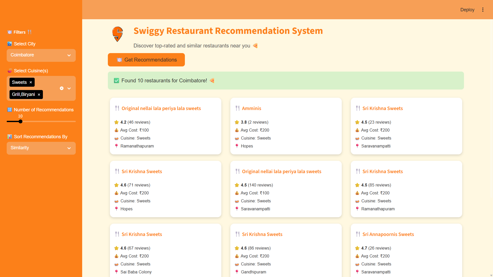

# 🍴 Swiggy Restaurant Recommendation System

## 📌 Problem Statement

Food delivery platforms like Swiggy offer thousands of restaurant choices across multiple cities. Choosing a suitable restaurant based on personal preferences (**city, cuisine, cost, rating**) becomes challenging for users.

The goal of this project is to develop a **restaurant recommendation system** that suggests top restaurants to users by analyzing **cuisine patterns, location, and restaurant similarity** using machine learning techniques. The recommendations are presented in a **Streamlit application** with an interactive interface.

---

## 🎯 Project Objectives

- 📥 Load and explore Swiggy restaurant dataset  
- 🧹 Perform data cleaning and handle missing values  
- 🧠 Apply One-Hot Encoding and Multi-Label Binarization for categorical features  
- 📏 Standardize numerical attributes  
- 🤖 Build a similarity-based recommendation system using **Cosine Similarity**  
- 🔄 Map recommendation results back to cleaned data  
- 🎨 Deploy recommendation system with a **Swiggy-themed Streamlit UI**  

---

## 🛠️ Technologies Used

- 🐍 **Programming Language:** Python  
- 📊 **Data Processing:** Pandas, NumPy  
- 🧬 **Feature Engineering:** MultiLabelBinarizer, OneHotEncoder, StandardScaler  
- 🤖 **Machine Learning:** Cosine Similarity (Scikit-Learn)  
- 🌐 **Model Deployment:** Streamlit  
- 💻 **Development Tools:** Jupyter Notebook, VS Code  

---

## 📂 Files & Notebooks

- 📘 `data_cleaning.ipynb` → Cleaning and transformation  
- 📙 `data_preprocessing.ipynb` → Encoding and scaling  
- 📗 `recommendation_system.ipynb` → Similarity-based recommendation  
- 🖥️ `streamlit_application.py` → Streamlit web application  
- 📄 `cleaned_data.csv` → Final cleaned dataset  
- 📄 `encoded_data.csv` → Encoded numerical dataset  

---

## 📊 Dataset Overview

- 📁 **Format:** CSV  
- 🍽️ **Records:** Multiple restaurants across major Indian cities  
- 📋 **Original Columns:**  
`'id','name','city','rating','rating_count','cost','cuisine','lic_no','link','address','menu'`
- 🎯 **Target:** No fixed target (Recommendation System)

---

## ⚠️ Dataset Characteristics

- ❌ Missing values in restaurant names and cuisines  
- 🏙️ Unstructured city names including area info  
- ⭐ Ratings like `"--"`  
- 📊 Rating counts like `"50+ ratings"`  
- 🍛 Cuisine values with multiple categories per restaurant  
- 💰 Cost values containing currency symbols  

---

## 🔗 Dataset URL

- 📎 [Google Drive Folder (Dataset)](https://drive.google.com/file/d/1oFn9nfrL1sx2XvRBwysffu66waHX7Sm4/view?usp=sharing)

---

## 🧠 Model Building Summary

### ✔ Feature Cleaning 🧹

- Set `"id"` column as index  
- Dropped non-predictive columns: `"lic_no"`,`"link"`,`"address"`,`"menu"`  
- Removed duplicate records  
- Dropped missing `"name"` and `"cuisine"` rows  
- Cleaned `"rating"` and `"rating_count"` using custom rules  
- Converted `"₹cost"` → integer  

---

### ✔ Feature Transformation 🔄

- Split `"city"` into `"City"` and `"Area"`  
- Converted `"cuisine"` into multiple labels  

---

### ✔ Encoding & Scaling 📏

- Applied **MultiLabelBinarizer** for multiple cuisines  
- Applied **OneHotEncoder** for City and Area columns  
- Standardized `"rating"`, `"rating_count"`, `"cost"`  
- Saved processed dataset as:
  - 📄 `cleaned_data.csv`
  - 📄 `encoded_data.csv`

---

## 🤖 Recommendation System Summary

- 🏙️ Filtering based on selected **City**  
- 🧠 Matching restaurants using **Cosine Similarity**  
- 🍛 Cuisine-based partial matching  
- 📋 Displaying:
  - Restaurant Name  
  - Rating & Rating Count  
  - Cost for Two  
  - Cuisine  
  - Area  
- 📊 Sorted based on **similarity** or **rating**  

---

## 🖥️ Streamlit Deployment

- 🎨 Swiggy-themed UI with custom CSS  
- 🧭 Sidebar filters:
  - 🏙️ Select City  
  - 🍜 Select Cuisine(s)  
  - 🔢 Number of recommendations  
  - 📊 Sort preference  
- 🧩 Card layout for restaurant results  

---

## ▶️ Run the Streamlit App

```bash
streamlit run streamlit_application.py
```

---

## 📸 Streamlit Application Screenshots




---

## 📈 Results

- ✅ Successfully built a functional restaurant recommendation system  
- ⚡ UI provides quick and relevant suggestions  
- 🧹 Data cleaning and encoding made similarity matching accurate  
- 🚀 End-to-end system ready for real-world usage with improvements  

---

## 📏 Project Evaluation Metrics

As this is a recommendation system, evaluation is based on:

- 🎯 Recommendation Relevance  
- 📊 Data Quality & Preprocessing  
- 🎨 User Interface Experience  
- 🔗 Index Alignment between datasets  

✅ All metrics satisfied in current system.

---

## 🏁 Conclusion

The **Swiggy Restaurant Recommendation System** demonstrates a complete **Machine Learning workflow**:

- 🧹 Cleaning and preprocessing real-world restaurant data  
- 🧠 Encoding complex categorical data including multi-cuisine restaurants  
- 🤖 Building similarity-based personalized recommendations  
- 🌐 Deploying in Streamlit with interactive UI and custom branding  

This project enhances **restaurant discovery** and can be further expanded with **deployment and real-time data updates**.  
Overall, this project shows how **machine learning can enhance food delivery platforms** by providing **personalized restaurant recommendations** to users 🍽️✨

---

⭐ If you found this project useful, feel free to star the repository!
